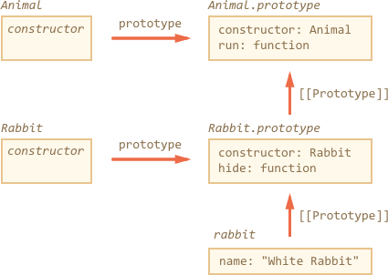
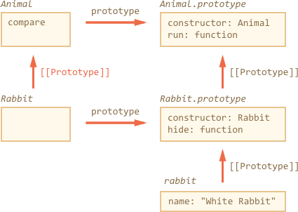
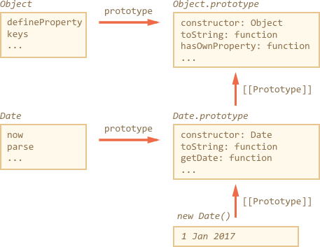

# Class inheritance, super

Las clases pueden extenderse unas a otras. Hay una buena sintaxis, técnicamente basada en la herencia prototípica.

Para heredar de otra clase, debemos especificar `"extended"` y la clase padre antes de los corchetes `{..}`.

Aquí `Rabbit` hereda de `Animal`:

```js run
class Animal {

  constructor(name) {
    this.speed = 0;
    this.name = name;
  }

  run(speed) {
    this.speed += speed;
    alert(`${this.name} runs with speed ${this.speed}.`);
  }

  stop() {
    this.speed = 0;
    alert(`${this.name} stopped.`);
  }

}

*!*
// Inherit from Animal
class Rabbit extends Animal {
  hide() {
    alert(`${this.name} hides!`);
  }
}
*/!*

let rabbit = new Rabbit("White Rabbit");

rabbit.run(5); // White Rabbit runs with speed 5.
rabbit.hide(); // White Rabbit hides!
```

La palabra clave `extends` en realidad agrega una referencia`[[Prototype]]`desde`Rabbit.prototype` a `Animal.prototype`, tal como espera que sea, y como hemos visto antes.



Así que ahora `rabbit` tiene acceso tanto a sus propios métodos como a los métodos de `Animal`.

##### "Se permite cualquier expresión después del `extends`"

La sintaxis de clase permite especificar no solo una clase, sino también cualquier expresión después de `extended`.

Por ejemplo, una llamada a la función que genera la clase padre:

```js run
function f(phrase) {
  return class {
    sayHi() { alert(phrase) }
  }
}

*!*
class User extends f("Hello") {}
*/!*

new User().sayHi(); // Hello
```

Aquí `class User` se hereda del resultado de `f("Hello")`.

Eso puede ser útil para patrones de programación avanzados cuando usamos funciones para generar clases dependiendo de muchas condiciones y podemos heredar de ellas.

## Overriding a method

Ahora avancemos y anulemos un método. A partir de ahora, `Rabbit` hereda el método `stop` que establece `this.speed = 0` de`Animal`.

Si especificamos nuestro propio `stop` en `Rabbit`, entonces se usará en su lugar:

```js
class Rabbit extends Animal {
  stop() {
    // ...this will be used for rabbit.stop()
  }
}
```

... Pero, por lo general, no queremos reemplazar totalmente un método principal, sino construirlo, modificarlo o ampliar su funcionalidad. Hacemos algo en nuestro método, pero llamamos al método padre antes/después o en el proceso.

Las clases proporcionan la palabra clave `super` para eso.

- `super.method(...)` para llamar a un método padre.
- `super(...)` para llamar a un constructor padre (solo dentro de nuestro constructor).

Por ejemplo, haremos que nuestro conejo se oculte cuando se detenga:

```js run
class Animal {

  constructor(name) {
    this.speed = 0;
    this.name = name;
  }

  run(speed) {
    this.speed += speed;
    alert(`${this.name} runs with speed ${this.speed}.`);
  }

  stop() {
    this.speed = 0;
    alert(`${this.name} stopped.`);
  }

}

class Rabbit extends Animal {
  hide() {
    alert(`${this.name} hides!`);
  }

*!*
  stop() {
    super.stop(); // call parent stop
    this.hide(); // and then hide
  }
*/!*
}

let rabbit = new Rabbit("White Rabbit");

rabbit.run(5); // White Rabbit runs with speed 5.
rabbit.stop(); // White Rabbit stopped. White rabbit hides!
```

Ahora `Rabbit` tiene el método `stop` que llama al padre `super.stop()` en el proceso.

##### "Arrow functions have no `super`"

Como se mencionó en el capítulo <info:arrow-functions>, las funciones de flecha no tienen `super`.

Si se accede, se toma de la función externa. Por ejemplo:

```js
class Rabbit extends Animal {
  stop() {
    setTimeout(() => super.stop(), 1000); // call parent stop after 1sec
  }
}
```

El `super` en la función de flecha es el mismo que en `stop()`, por lo que funciona según lo previsto. Si especificamos una función "regular" aquí, habría un error:

```js
// Unexpected super
setTimeout(function() {
  super.stop();
}, 1000);
```

## Overriding constructor

Con los constructores se pone un poco complicado.

Hasta ahora, `Rabbit` no tenía su propio `constructor`.

De acuerdo con la [specification](https://tc39.github.io/ecma262/#sec-runtime-semantics-classdefinitionevaluation), si una clase extiende otra clase y no tiene un `constructor`, entonces se genera el siguiente `constructor`:

```js
class Rabbit extends Animal {
  // generated for extending classes without own constructors
*!*
  constructor(...args) {
    super(...args);
  }
*/!*
}
```

Como podemos ver, básicamente llama al `constructor` padre pasándole todos los argumentos. Eso sucede si no escribimos un constructor propio.

Ahora vamos a agregar un constructor personalizado a `Rabbit`. Especificará el `earLength` además de `name`:

```js run
class Animal {
  constructor(name) {
    this.speed = 0;
    this.name = name;
  }
  // ...
}

class Rabbit extends Animal {

*!*
  constructor(name, earLength) {
    this.speed = 0;
    this.name = name;
    this.earLength = earLength;
  }
*/!*

  // ...
}

*!*
// Doesn't work!
let rabbit = new Rabbit("White Rabbit", 10); // Error: this is not defined.
*/!*
```

Whoops! Tenemos un error. Ahora no podemos crear conejos. ¿Qué salió mal?

La respuesta corta es: los constructores en clases heredadas deben llamar a `super(...)`, y (!) Hacerlo antes de usar `this`.

...¿Pero por qué? ¿Que está pasando aqui? De hecho, el requisito parece extraño.

Por supuesto, hay una explicación. Vamos a entrar en detalles, para que realmente entiendas lo que está pasando.

En JavaScript, hay una distinción entre una "función constructora de una clase hereditaria" y todas las demás. En una clase hereditaria, la función constructora correspondiente está etiquetada con una propiedad interna especial `[[ConstructorKind]]:" derived"`.

La diferencia es:

- Cuando se ejecuta un constructor normal, crea un objeto vacío como `this` y continúa con él.
- Pero cuando un constructor derivado se ejecuta, no lo hace. Se espera que el constructor padre haga este trabajo.

Entonces, si estamos haciendo nuestro propio constructor, entonces debemos llamar `super`, porque de lo contrario el objeto con la referencia `this` no se creará. Y obtendremos un error.

Para que `Rabbit` funcione, debemos llamar a `super()` antes de usar `this`, como aquí:

```js run
class Animal {

  constructor(name) {
    this.speed = 0;
    this.name = name;
  }

  // ...
}

class Rabbit extends Animal {

  constructor(name, earLength) {
*!*
    super(name);
*/!*
    this.earLength = earLength;
  }

  // ...
}

*!*
// now fine
let rabbit = new Rabbit("White Rabbit", 10);
alert(rabbit.name); // White Rabbit
alert(rabbit.earLength); // 10
*/!*
```

## Static methods and inheritance

La sintaxis `class` también admite la herencia de propiedades estáticas.

Por ejemplo:

```js run
class Animal {
  constructor(name, speed) {
    this.speed = speed;
    this.name = name;
  }

  run(speed = 0) {
    this.speed += speed;
    alert(`${this.name} runs with speed ${this.speed}.`);
  }

  static compare(animalA, animalB) {
    return animalA.speed - animalB.speed;
  }
}

// Inherit from Animal
class Rabbit extends Animal {
  hide() {
    alert(`${this.name} hides!`);
  }
}

let rabbits = [new Rabbit("White Rabbit", 10), new Rabbit("Black Rabbit", 5)];

rabbits.sort(Rabbit.compare);

rabbits[0].run(); // Black Rabbit runs with speed 5.
```

Ahora podemos llamar a `Rabbit.compare` asumiendo que se llamará a `Animal.compare` heredado.

¿Como funciona? De nuevo, utilizando prototipos. Como ya habrás adivinado, extendido también le da a `Rabbit` la referencia `[[Prototype]]` a `Animal`.



Entonces, la función `Rabbit` ahora hereda de la función `Animal`. Y la función `Animal` normalmente tiene `[[Prototype]]` haciendo referencia a`Function.prototype`, porque no `extends` nada.

Aquí, vamos a comprobar que:

```js run
class Animal {}
class Rabbit extends Animal {}

// for static propertites and methods
alert(Rabbit.__proto__ === Animal); // true

// and the next step is Function.prototype
alert(Animal.__proto__ === Function.prototype); // true

// that's in addition to the "normal" prototype chain for object methods
alert(Rabbit.prototype.__proto__ === Animal.prototype);
```

De esta manera, `Rabbit` tiene acceso a todos los métodos estáticos de `Animal`.

### No static inheritance in built-ins

Tenga en cuenta que las clases incorporadas no tienen dicha referencia estática `[[Prototype]]`. Por ejemplo, `Object` tiene `Object.defineProperty`, `Object.keys` y así sucesivamente, pero `Array`, `Date` etc. no los heredan.

Aquí está la estructura de la imagen para `Date` y `Object`:



Tenga en cuenta que no hay un vínculo entre `Date` y`Object`. Tanto `Object` como `Date` existen independientemente. `Date.prototype` hereda de `Object.prototype`, pero eso es todo.

Dicha diferencia existe por razones históricas: no se pensó en la sintaxis de clase y en la herencia de métodos estáticos en los albores del lenguaje JavaScript.

## Natives are extendable

Las clases incorporadas como Array, Map y otras también son extensibles.

Por ejemplo, aquí `PowerArray` se hereda del `Array` nativo:

```js run
// add one more method to it (can do more)
class PowerArray extends Array {
  isEmpty() {
    return this.length === 0;
  }
}

let arr = new PowerArray(1, 2, 5, 10, 50);
alert(arr.isEmpty()); // false

let filteredArr = arr.filter(item => item >= 10);
alert(filteredArr); // 10, 50
alert(filteredArr.isEmpty()); // false
```

Por favor, tenga en cuenta una cosa muy interesante. Métodos incorporados como `filter`, `map` y otros: devuelven objetos nuevos del tipo heredado exactamente. Ellos confían en la propiedad `constructor` para hacerlo.

En el ejemplo anterior,

```js
arr.constructor === PowerArray;
```

Entonces, cuando se llama a `arr.filter()`, crea internamente la nueva matriz de resultados exactamente como `new PowerArray`. Y podemos seguir usando sus métodos más abajo en la cadena.

Aún más, podemos personalizar ese comportamiento. El captador estático `Symbol.species`, si existe, devuelve el constructor para usar en tales casos.

Por ejemplo, aquí debido a los métodos incorporados `Symbol.species` como `map`, `filter` devolverá las matrices "normales":

```js run
class PowerArray extends Array {
  isEmpty() {
    return this.length === 0;
  }

*!*
  // built-in methods will use this as the constructor
  static get [Symbol.species]() {
    return Array;
  }
*/!*
}

let arr = new PowerArray(1, 2, 5, 10, 50);
alert(arr.isEmpty()); // false

// filter creates new array using arr.constructor[Symbol.species] as constructor
let filteredArr = arr.filter(item => item >= 10);

*!*
// filteredArr is not PowerArray, but Array
*/!*
alert(filteredArr.isEmpty()); // Error: filteredArr.isEmpty is not a function
```

Podemos usarlo en teclas más avanzadas para eliminar la funcionalidad extendida de los valores resultantes si no es necesario. O, tal vez, para extenderlo aún más.
